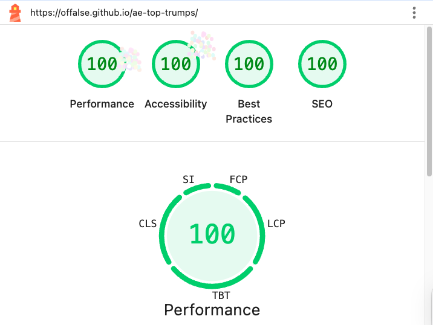
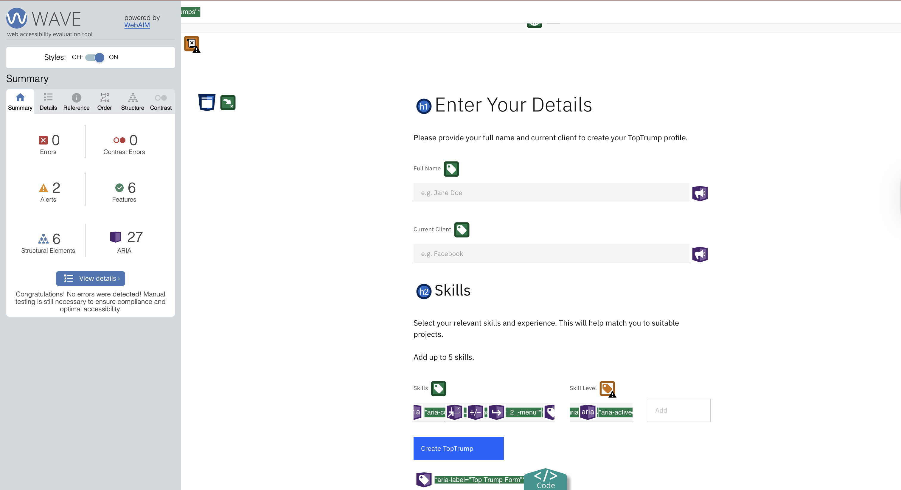
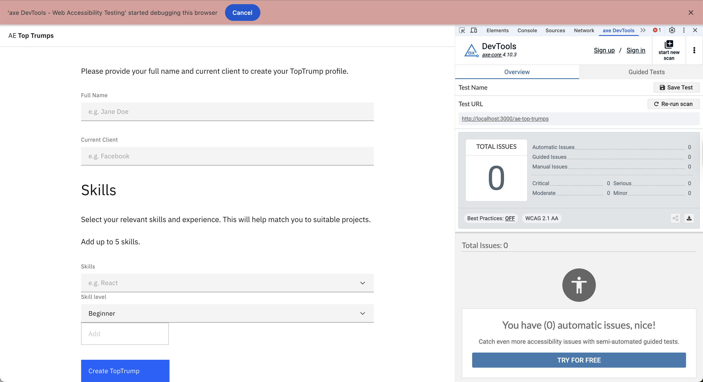
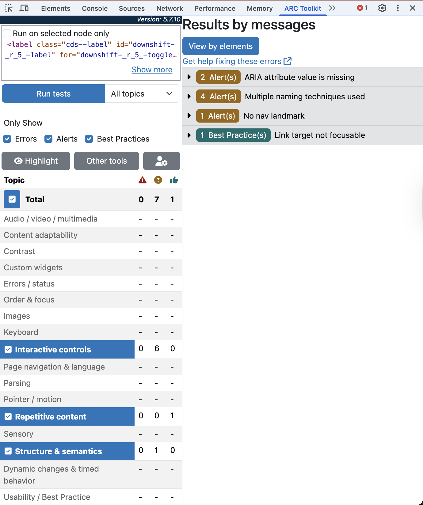

# Top Trump Profile Generator

The main goal of this project is to create a highly accessible and efficient client-side application that standardises and gamifies the display of professional profiles in the workplace. This tool, the **Top Trump Profile Generator**, tackles the current absence of an automated, visually appealing way to generate standardised team profiles. It enables users to input essential professional data (Full Name, Client) and choose up to five key skills, each with a corresponding proficiency level, resulting in a downloadable, colour-coded Top Trump Card.

---

## Project Roadmap and Scope Definition

The project adhered to a timeline, prioritising both core functionality and several Non-Functional Requirements (NFRs).

The project scope is strictly defined as a **UI-only application**. The focus is placed intensely on client-side state management, input validation, component rendering, and rigorous NFR compliance. Backend integration is limited to fetching industry standard skill labels via an **API call** for the skill list. Crucially, the application is **stateless**, meaning data is not persisted after the browser session.

## 

## Business Justification and Strategic Value

In a fast-paced **consultancy environment**, the ability to quickly assemble effective project teams is a vital competitive advantage. Resourcing managers, responsible for assigning candidates to roles, and bid teams constantly face the challenge of evaluating numerous candidates to find the ideal fit for client engagements. Traditional methods, such as manually sifting through CVs or complex spreadsheets, are time-consuming and prone to inconsistency. This project addresses this inefficiency by developing a tool for instant, standardised skills visualisation.

The core business driver is the need for **rapid evaluation**. Resourcers must assess a consultant's core competencies **at a glance**. By distilling a profile down to five key skills in a clear, visual format, the Top Trump Generator enables quick comparisons. The skills list must be based on **industry standards** to align internal descriptions with client terminology in Request for Proposals and project briefs, streamlining bidding and enhancing professional engagements.

### Gamification: The Top Trump Format

The choice of a "Top Trump" format is a deliberate strategy to utilise the principles of gamification for business purposes. This classic card game format is intuitively understood and highly effective for comparing data.

- **Instant Understanding**: The card visually organises information, presenting ratings and categories that are instantly clear. It is far more engaging and memorable than a simple list or paragraph. A resourceful person can grasp the key strengths of a candidate within seconds.
- **Enables Direct Comparison**: The core mechanic of Top Trumps is comparing statistics. This allows managers to place two or more candidate cards side by side and assess objectively who is stronger in a required skill, such as 'Cloud Architecture' or 'Agile Delivery'.
- **Promotes Data Simplification**: By restricting skills to five, the format compels consultants and their managers to focus on their most relevant and impactful capabilities, cutting through the complexity of exhaustive, multi-page CVs. It addresses the question: "What are you an expert in _right now_?".
- **Enhances Engagement**: Introducing a fun, slightly competitive element to profile management can boost user adoption and motivate employees to update their profiles regularly. It cultivates a culture where skills and professional development are openly recognised and valued.

---

## Technology Stack Rationale

The development leverages a modern technology stack, utilising **React with TypeScript** for robust code architecture and integration with the **Carbon Design System (CDS)** to ensure enterprise-grade accessibility and responsiveness. The selection of this stack was a strategic decision aimed at maximising performance, scalability, and development speed.

**TypeScript** on top of React introduces static typing, which is critical for building a robust and reliable application. It catches potential errors during the development phase, not in production, leading to higher code quality and productivity and elevates the systems robustness which is non-negotiable for critical business tools.

### Carbon Design System (CDS)

Choosing an established design system like Carbon instead of building components from scratch or using a more generic library like Bootstrap was crucial for creating a professional and accessible user interface rapidly. CDS is specifically designed for enterprise applications, providing a comprehensive set of pre-built, **WCAG-compliant** components. This ensures that the tool is not only visually consistent and professional but also usable by all employees, regardless of their abilities. These pre-built features saved hundreds of hours of development that would have otherwise been spent on designing, building, and testing customised UI elements, allowing the project to focus on its core business logic.

## Project Requirements

The following requirements were defined in consultation with stakeholders and prioritised using the MoSCoW methodology (assumed complete).

### MoSCoW Prioritization

A method for categorizing requirements to manage stakeholder expectations and prioritize work. The definitions used are as follows:

- **Must-have:**: Non-negotiable requirements. The release is a failure without them.
- **Should-have:** Important but not vital. Adds significant value.
- **Could-have:** Desirable "nice-to-have" items with a smaller impact.
- **Won't-have (this time):** Explicitly out of scope for the current timeframe.

### 1. Functional Requirements: User Interface (UI)

| Requirement                    | Implementation Detail (Carbon Design System)                                                                                     | Priority (MoSCoW) |
| :----------------------------- | :------------------------------------------------------------------------------------------------------------------------------- | :---------------- |
| **User Identification Inputs** | **CDS TextInput** components for **Full Name** and **Client** identification.                                                    | Must Have         |
| **Skill Selection Interface**  | **CDS ComboBox** for selecting skills (from mock API data) and a corresponding **CDS Dropdown** for proficiency level selection. | Must Have         |
| **Dynamic Skill List**         | A visible, dynamic list that appends selected skills/levels, strictly limited to **five items**.                                 | Must Have         |
| **Card Generation Trigger**    | A primary **CDS Button** labelled "Generate Top Trump" to initiate the final output rendering.                                   | Must Have         |
| **Profile Display**            | Displays the generated card, including a **CDS Avatar**, Full Name, Client, and skills rendered as color-coded **CDS Tags**.     | Must Have         |
| **Profile Picture**            | A fiel upload that accepts images as **.jpg, .png, and .svg** that is displayed in place of the **CDS Avatar** when provided.    | Could Have        |

### 2. Functional Requirements: Logic and Data

| Requirement                             | Implementation Detail                                                                                                                          | Priority (MoSCoW) |
| :-------------------------------------- | :--------------------------------------------------------------------------------------------------------------------------------------------- | :---------------- |
| **Input Validation**                    | Client-side validation to ensure text fields (**Full Name, Client**) are non-empty.                                                            | Must Have         |
| **Skill Level Colour Logic**            | Logic to map proficiency levels to specific colours for the CDS Tags: **Expert: purple, Advanced: blue, Intermediate: green, Beginner: grey**. | Should Have       |
| **Skill Limit Validation**              | Logic to enforce the **maximum of 5 skills**, displaying a custom inline error message upon attempted overflow.                                | Should Have       |
| **Skill List Source**                   | Skill data for the ComboBox is sourced via an **API call** integration with industry standard skills API.                                      | Should Have       |
| **Authentication / Sign In**            | **None required**.                                                                                                                             | Won't Have        |
| **UI State Persistence**                | **None required**.                                                                                                                             | Won't Have        |
| **Backend API or Database Persistence** | **None required**.                                                                                                                             | Won't Have        |

### 3. Non-functional Requirements (NFRs)

| Requirement                  | Measurement and Tooling                                                                                                                | Priority (MoSCoW) |
| :--------------------------- | :------------------------------------------------------------------------------------------------------------------------------------- | :---------------- |
| **Downloadable Output**      | The final Top Trump card must be exportable (e.g., as a PNG or PDF).                                                                   | Must Have         |
| **Accessibility Compliance** | Audit compliance using **WAVE, Arc Toolkit, and axeDevTools reports**. Preliminary audit via **Google Lighthouse**.                    | Must Have         |
| **Performance**              | Generation process under **1 second** perceived response time. Measured via **Google Lighthouse** performance score (Target: 100/100). | Should Have       |
| **Responsive Design**        | Application must be usable on both desktop and mobile devices.                                                                         | Should Have       |

### 5. User Stories

The following user stories capture the core goals and benefits for the primary user of the Top Trump Profile Generator:

1. **Profile Data Input**
   _As a_ team member, _I want_ to easily input my Full Name and Client details using standard text fields, _so that_ I can identify the profile being generated.

2. **Skill Selection and Limit Enforcement (Logic)**
   _As a_ team member, _I want_ to be able to select a maximum of five skills and their corresponding proficiency levels from a standardized list, _so that_ the generated card is focused and accurately reflects my core expertise without being overloaded.

3. **Card Generation and Visual Feedback**
   _As a_ user, _I want_ to click a button and see the final Top Trump card displayed immediately, with skills color-coded (e.g., 'Expert' as purple),_so that_ I have a fast, clear, and gamified visual summary of my profile.

4. **Accessibility Compliance (NFR)**
   _As a_ user relying on assistive technologies (like a screen reader), _I want_ the application's forms, buttons, and generated content to be fully accessible and correctly labeled, _so that_ I can use the profile generator effectively and without barriers.

5. **Profile Export (NFR)**
   _As a_ user, _I want_ a dedicated option to download the final generated Top Trump card as an image (PNG or PDF), _so that_ I can easily share, print, or use the card in other documentation. |

## Project Stakeholders

As this is a solo endeavour, I will oversee the product, including the vision and scope definition, delivery, ensuring adherence to timelines, activity tracking on a KanBan board, and development tasks, including all build, testing, and deployment activities related to this product.

## Project Risks

To ensure project risks are factored into the development process, I created a risk matrix which covers potential risks, their likelihoods, impacts, and mitigation strategies. This enabled me to be more proactive in tackling risks and avoiding serious issues within the development process.

| **Risk**                       | **Likelihood** | **Impact** | **Priority** | **Mitigation Strategy**                                                              |
| ------------------------------ | -------------- | ---------- | ------------ | ------------------------------------------------------------------------------------ |
| **API for Skills Unavailable** | Medium         | High       | Critical     | - Implement a fallback mechanism allowing users to input custom skills in the field. |
| **Github CI/CD Support**       | Low            | High       | High         | - 2000 minutes of free support and upgrades can be purchased                         |
|                                |                |            |              | - Assign CI/CD pipelines to run only on main branch merges.                          |
| **Scope Creep**                | Medium         | Medium     | Medium       | - Define MVP project scope and apply MoSCoW.                                         |
|                                |                |            |              | - Define extended scope and address upon MVP completion if timeframe permits.        |

## Project Management

### Project Organisation Tool

I used GitHub Projects, integrated with my repository, to set up a KanBan board featuring five key sections.

- Backlog - Tasks that have been documented and are ready for development to commence.
- In-Progress - Tasks currently being worked on but not yet finished.
- Done- Completed and merged tasks into main branch.
- Not required - To help identify redundancies in tickets or tickets who's scope has been addressed elsewhere.

Other sections, such as "Ready" and "Review", have been omitted from this list as it is a solo endeavour and does not require external validation.

### Ticket Templating and Sizing

One of the initial stages of the project involved setting up ticket templates. These templates ensured tickets were created with a consistent format and information by pre-filling specific questions or headings each time a new ticket was made. To make these templates as relevant as possible, I created a single template for all types of issues, called “feature,” as the structure could be applied universally.

The screenshot below shows an example of the blank "feature" template, prior to filling in the details. The template includes four main sections: Title, Definition of Done and Acceptance Criteria. These predefined fields reduce the time needed to create detailed tickets, streamline the process, and minimise the risk of missing important information by prompting the author to provide concise and specific information.

Using custom labels in GitHub, I assigned each ticket or issue a size based on the estimated effort, number of unknowns, and expected completion time. I opted for Fibonacci sequence sizes because this method is simple, consistent, and emphasises effort and complexity over time. I also believe that the larger gaps between Fibonacci sizes better represent the increasing complexities and unknowns as you move up the scale than other well-regarded approaches

To ensure sizing was as effective as possible, it was important to make sure tasks were sized consistently, to do this, I used the below guide to accurately size each ticket based on the existing system as well as my current knowledge, skills and understanding.

- 0 - Very simple tasks that are well understood and require little to no effort.
- 1 - Small tasks that are simple, without unknowns, but will take a short time to implement.
- 3 - Moderately complex tasks. May involve some uncertainties but are generally straightforward.
- 5 - Larger or more complex tasks, involving multiple steps or uncertainties.
- 8 - Highly complex with significant uncertainty; these may involve architectural changes. Consider breaking them down into smaller tickets.
- 13 - This ticket is too large and should be divided into smaller tasks.

## Product Design

## Wireframes

## Process Flow

## Error Handling and Validation

## Development

### Activity timeline

### Continuous Integration/Continuous Deployment (CI/CD)

The project uses **GitHub Actions** to create a reliable and efficient Continuous Integration/Continuous Deployment (CI/CD) pipeline, guaranteeing code quality and smooth delivery to the production environment hosted on **GitHub Pages**. This automated pipeline consists of three separate stages.

1. **Test**: This stage runs the complete test suite using `npm run test --coverage`. This step is essential for verifying functionality and code robustness, acting as a safeguard to detect potential issues before deployment.
2. **Build**: In this stage, the production build is generated. It securely retrieves **secret API keys** and the deployment **URL slug** (e.g., for routing or configuration) from **Environment Secrets** and incorporates them into the `npm build` command. This method ensures security by keeping sensitive credentials confidential.
3. **Deploy**: The final step deploys the fully built application to the live production environment hosted on **GitHub Pages**.

### Optimisation and Security

- **Compute Preservation**: The pipeline is designed to run exclusively on the `main` branch, which is dedicated solely to deployment targets. This intentional choice conserves computing resources by avoiding unnecessary builds on the `develop` branch or feature branches, where work-in-progress is generally merged.
- **Security and Robustness**: Security is evidenced by utilising **Environment Secrets** to hide sensitive API keys. Robustness in delivery is maintained by enforcing comprehensive testing before every deployment, preventing faulty code from reaching production.

### Accessibility and Performance Metrics

### Test-Driven Development

## Analysis and Reflection

## Final Product: Desktop and Mobile view

Screenshots of the final product are available below, as well as a link to the deployed service which can be found at: https://offalse.github.io/ae-top-trumps/

### Desktop View

### Mobile View

## Future Extensibility

### Data Persistence and Architecture

- Transition the application from its current stateless, UI-only design to a persistent, multi-user platform by implementing a **dedicated database** for permanent storage and establishing **UI synchronisation** mechanisms supported by robust **session management** and user **authentication**.

### Profile Data Enrichment

- Expand the core profile model by adding high-value business intelligence fields, including real-time or projected **Availability** and internal resource **Cost** metrics, to support the application's use in project planning and resource allocation.

### User Management and Access

- Integrate a **User Database** to securely handle authentication, manage user ownership of profiles, and implement **authorisation roles** (e.g., Creator, Viewer, Admin) to control access to sensitive data and features.

### Advanced Analytics and UI Features

- Develop advanced interactive features such as **UI comparison** tools that enable users to select and view multiple Top Trump profiles side-by-side for assessing skill, cost, and availability.
- Introduce user-focused features, including **customisable views** (e.g., theming, layout adjustments) and powerful **Role x Skill filtering** to support complex, detailed queries across the entire profile database.

### Regional Deployment

- Develop a multi-region deployment plan (e.g., Active-Active architecture in NA, EU, and APAC) using a global CDN and local database clusters to ensure optimal performance, low latency, and compliance with regional data sovereignty and regulations (e.g., GDPR).
